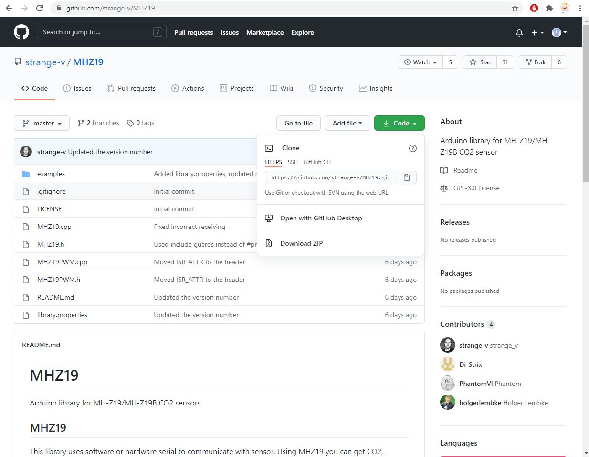
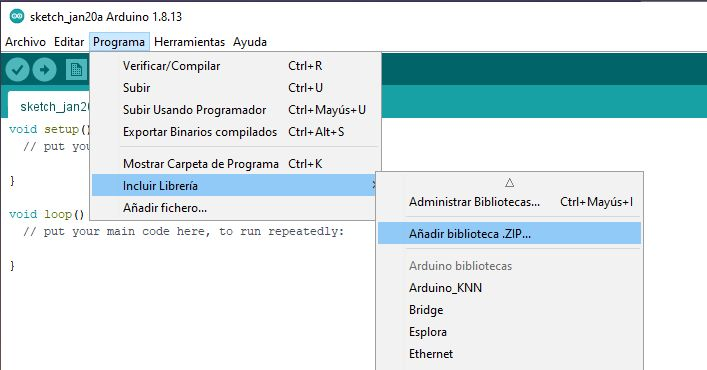

# README - SENSOR DE CO2

Este documento describe como realizar un dispositivo de bajo costo para registrar la cantidad de CO2 que hay en el aire, indicando mediante un semáforo en que situación nos encontramos. Se incluyen dos versiones de programa en función de si necesitamos solo un avisador de CO2 máximo o si queremos llevar un control de aire, temperatura y humedad más sofisticado y centralizado mediante la consola de Grafana.

----------

TIEMPO ESTIMADO: **240 min**

-------

APRENDERÁS:

```
IDE ARDUINO, IC2, INCLUSIÓN DE LIBRERÍAS, WIFI, DOCKER, INFLUXDB, TELEGRAPH, GRAFANA, MQTT, SENSORES
```

------

## Visión general

El año 2020 nos sorprendió a todos con la llegada de un virus devastador que ha infectado a todo el mundo sin distinción de raza, sexo o credo. Las fronteras políticas y geográficas han sido meras entelequias humanas que este ser ha despreciado y no han parado en su expansión. 

La humanidad se ha visto amenazada de forma inesperada y con una rapidez no vista en mucho tiempo. Solo los confinamientos masivos por parte de las naciones han conseguido contener o mitigar el avance del mismo, siendo las otras alternativas, mucho menos efectivas. La dualidad entre el mantenimiento de la economía y la preservación de la salud de la población es el tema que más preocupa a los dirigentes del mundo, ya que este se debate entre morir de COVID o un derrumbe de la economía sin precedentes. Muchas de las voces autorizadas del mundo, comparan la reciente situación como mucho peor a la reciente segunda guerra mundial y poder mantener el tejido productivo en marcha sorteando los contagios es el reto que nos tiene en marcha durante el final del 2020 principios del 2021. Hasta que el mundo entero no se inmunice mediante el uso de vacunas o la reversión del virus, tenemos que ser capaces de buscar formas o soluciones que nos ayuden a protegernos y mantener un mínimo de actividad. 

Es por eso, que científicos del mundo han considerado la relación entre la ventilación y  la transmisión del virus como una parte fundamental en la expansión del mismo. Un espacio mal o poco ventilado con infectados por el virus es la causa más habitual de contagio. Es por ello, que para poder controlar la calidad del aire se apuesta por sensores de CO2 que nos indican, no si existen patógenos de COVID en suspensión, sino cuan viciado está el aire. La relación entre cantidad de CO2 y patógeno COVID es directa, con lo cual no es necesario medir niveles de COVID, sino de CO2 y nos aseguraremos un aire limpio sin costes elevados.

Este proyecto trata de obtener lecturas de varios sensores (de CO2, temperatura y humedad) para indicar la calidad del aire en función del CO2. El controlador que se encarga de ello se trata de un Wemos D1 Mini que es un microcontrolador pequeño, barato y con Wifi, que nos permitirá recoger los datos necesarios y enseñarlos mediante un semáforo de colores e incluso, si disponemos de red Wifi, mediante una pequeña página web.

El proyecto tiene una segunda parte, más elaborada y compleja, que pretende realizar un sistema de control centralizado de los datos que toma el microcontrolador, usando bases de datos y el sistema gestor de gráficas y dashboards, llamado Grafana. Todo este sistema, se puede instalar sobre un PC, una máquina virtual, una raspberry, etc... pero para hacerlo mucho más modular y portable, se ha optado por hacerlo mediante docker-compose que permite replicarlo con muy poco esfuerzo.


> **Nota:** Sea cual sea el nivel de integración que se quiera llevar a cabo, tanto los dispositivos, montaje como código, son los mismos y totalmente funcionales para el nivel básico y no es necesario temer por si no se quiere pasar al proyecto de monitorización con Grafana. Desde un principio se ha pensado en poderlo llevar a cabo sin más pretensión que el nivel básico y no penaliza a aquellos que no quieran complicarse la vida o no necesiten tanto nivel de monitorización


## Dispositivo básico

El dispositivo básico registrará los datos de CO2, temperatura y humedad de los sensores que incorpora.  Una vez montado el circuito, cargado el programa al Wemos y dado corriente, este empezará con un proceso de precalentado (3 minutos en los que los 3 leds parpadearán de forma secuencial) y se encenderá el led que corresponda al nivel de CO2.

### Componentes necesarios

-  1 x Wemos D1 Mini
-  3 x Resistencias 220 Ohm
-  3 x Led (Rojo, Naranja y Verde)
-  1 x MHZ19B
-  1 x BME 280
-  1 x Protoboard/PCB
-  1 x Cable USB
-  1 x Fuente alimentación 5V/1A

### Diagrama esquemático

Esquema

Fritzing

### Construir el circuito

Construcción paso a paso del circuito con fritzing

Notas:

Indicaciones del sensor de CO2, del sensor de temperatura y humedad y del Wemos D1 mini

### Creación del código

1. **Importación de la placa Wemos D1 mini**

Lo primero que debemos hacer al abrir el Arduino IDE es importar los microcontroladores que queremos que sea capaz de compilar. Para ello, añadiremos la linea

```
http://arduino.esp8266.com/stable/package_esp8266com_index.json
```

a las preferencias del IDE/Gestión de URLs adicionales de tarjetas:


Podemos ver que lo hemos importado bien si encontramos la placa LOLIN(WEMOS) D1 R2 & mini en el menu Herramientas\Gestor de tarjetas\ESP8266 Boards (2.7.4) 


2. **Importación de las librerías del sensor de CO2**

Debemos bajarnos el ZIP de la librería que está en https://github.com/strange-v/MHZ19 e importarlo como librería. 




Vamos al menú Programa\Incluir Librería\Añadir biblioteca .ZIP




Podemos comprobar que está bien si encontramos la librería en el menú Programa\Incluir Librería\MHZ19


3. **Importación de las librerías del sensor de temperatura**

En este caso es más sencillo, ya que tenemos que añadir solo las librerías de Adafruit y que ya están listadas por defecto. Vamos al menú Programa\Incluir Librería\Administrar bibliotecas y buscamos por BME. Elegimos la librería de Adafruit


Igualmente comprobaremos que lo hemos cargado correctamente si aparece dentro de las librerías disponibles.


