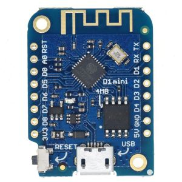
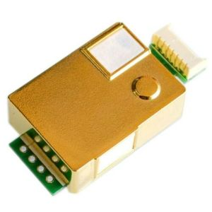
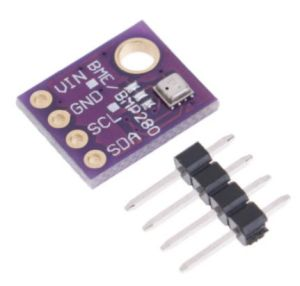
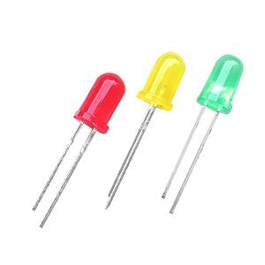
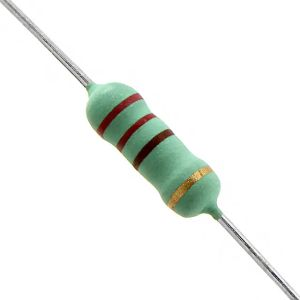

# CO2 Weather Sensor

## Building a CO2 and weather station with Wemos D1 mini micro controller, MH Z19B and BM280 sensors

The purpose of this project is to help teachers know when to ventilate the classroom because it is reaching dangerous CO2 levels. By creating this device, teachers will have a reliable tool for measuring the CO2 level of their classes, cheap and easy to build. 
Using simple signals (traffic lights) anyone can know the state of the air, if it is correct, worrying or dangerous. 
This system helps a lot to detect poor air quality and therefore a need to ventilate the classroom or the room where we are.

The second part of the project is to display meassures via dashboard available everywhere of the school even the Internet. By the use of dahsboards, we can have instant meassures of every single class from anywhere in the school, an historical and much more that could help us to improve the quality of air.

---

# BOM (Bill Of Materials)

We divide the project into several parts: on the one hand there is the hardware implementation of the device and on the other, the software that supports the extra functionalities that we want to get out of it.

First, the basis; the device itself:

- 1 x Wemos D1 mini
  

- 1 x MZ H19B CO2 sensor
  

- 1 x BME280 weather sensor
  

  

- 3 x LED (Red, Orange, Green)
  

  

- 3 x 220 ohm resistor
  

  

- 1 x PCB
  
  

Second, the extrapower; the uses of a dashboard to monitorize it:

- VM (2GB of RAM, 20GB of SSD) with Ubuntu Server 20.10
- Installation of docker as part of the installation of the OS (via snap)
- Registration of a public domain from duckdns.org
- Deployment of the following docker-compose instances: 
  - Reverse-proxy-server implemented with nginx + Public certificate from Letsencrypt 
  - Grafana-InfluxDB-Telegraf (TIG) and Mosquitto (Eclipse)

## Installation

### Part 1. Sensor as it self

This part allows you to build a complete functional CO2 sensor, that can run into the classroom to warning where to ventilate or opening doors and/or windows. It's perfectly correct although it is not capable to display CO2 meassures neither preassure or Celsius/Farenheit degrees. It only helps when to open doors and windows.

Here we have the diagram of the device

It's is powered by an USB cable that can be plugged in a computer or normal phone charger, ensuring 1A minimum of current.

We can observe here ther results if we open serial monitor from the Arduino IDE

----- FOTO DEL monitor serial ----

### Part 2. The code

You can find the code here into Arduino folder. You can use different tastes, Wifi o Wifi + MQTT. If you're not going to use monitoring or only want to test the device, I recommend you tou use Wifi only. In case you want to implement extra-power solution, Wifi + MQTT is your choice.

In the Wifi only part, we have several files:

- **CO2_thershold.h:** This file controls the limits of the CO2 meassures to turn on each led. The values proposed are:

  - GREEN: from 0 to 599 ppm
  - ORANGE: from 600 to 799 ppm
  - RED: above 800 ppm

  Feel free to use this values as you wish, having in mind OMS recommendations.

- **Config.h:** This file controls two delay times:

  - preheating time: This is the time the MHZ19b takes to start running. I do not recommend changing it
  - delay_Time: It refers time to show meassurements in serial monitor

- **Wifi_credentials.h:** Here you can insert your Wifi credentials. If you don't have ones, doesn't matter, the device will not send information

- 

