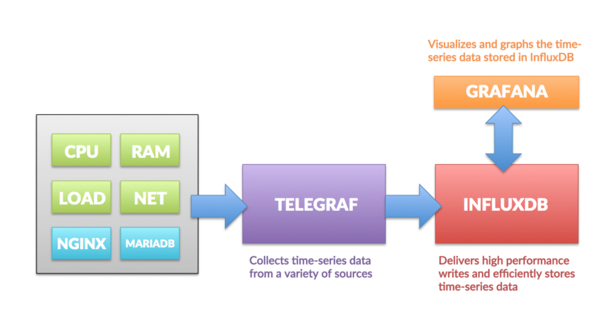
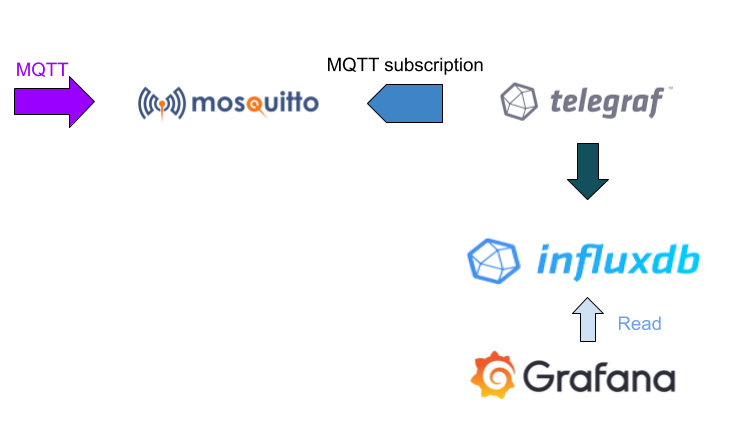
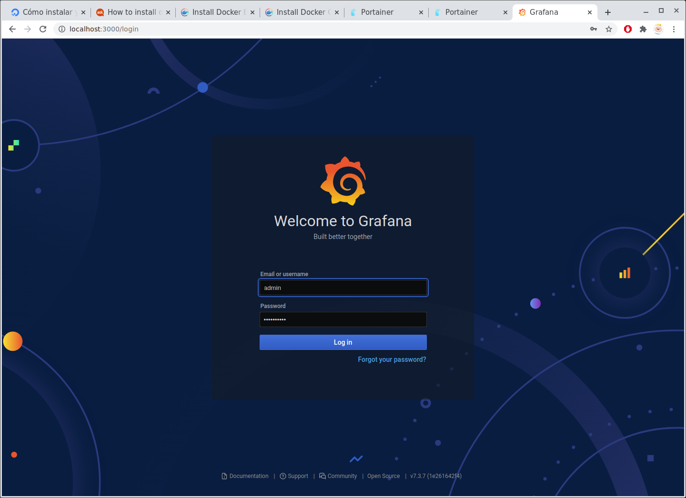

# README - SENSOR DE CO2

Este documento describe como realizar un dispositivo de bajo costo para registrar la cantidad de CO2 que hay en el aire, indicando mediante un semáforo en que situación nos encontramos. Se incluyen dos versiones de programa en función de si necesitamos solo un avisador de CO2 máximo o si queremos llevar un control de aire, temperatura y humedad más sofisticado y centralizado mediante la consola de Grafana.

----------

TIEMPO ESTIMADO: **120/240 min (básico/avanzado)**

-------

**APRENDERÁS:**

```
IDE ARDUINO, I2C, COMUNICACIÓN SERIE, INCLUSIÓN DE LIBRERÍAS, INCORPORACIÓN DE PLACAS, WIFI, DOCKER, INFLUXDB, TELEGRAPH, GRAFANA, MQTT, SENSORES
```

------

## Visión general

El año 2020 nos sorprendió a todos con la llegada de un virus devastador que ha infectado a todo el mundo sin distinción de raza, sexo o credo. Las fronteras políticas y geográficas han sido meras entelequias humanas que este virus ha despreciado y no le han parado en su expansión. 

La humanidad se ha visto amenazada de forma inesperada y con una rapidez no vista en mucho tiempo. Solo los confinamientos masivos por parte de las naciones han conseguido contener o mitigar el avance del mismo, siendo las otras alternativas, mucho menos efectivas. La dualidad entre el mantenimiento de la economía y la preservación de la salud de la población es el tema que más preocupa a los dirigentes del mundo, ya que este se debate entre salvaguardar nuestra salud o la economía. Muchas de las voces autorizadas del mundo, comparan la reciente situación como mucho peor a la reciente segunda guerra mundial y poder mantener el tejido productivo en marcha sorteando los contagios es el reto que nos tiene en marcha durante el final del 2020 principios del 2021. Hasta que el mundo entero no se inmunice mediante el uso de vacunas o la reversión del virus, tenemos que ser capaces de buscar formas o soluciones que nos ayuden a protegernos y mantener como se pueda la actividad económica. 

Es por eso, que científicos de todo el mundo han considerado la relación entre la ventilación y  la transmisión del virus como una parte fundamental en la expansión del mismo. Un espacio mal o poco ventilado con infectados por el virus es la causa más habitual de contagio. Los aerosoles han aparecido como vectores muy eficaces en la transmisión y es por ello, que para poder controlar estos aerosoles en el aire se apuesta por sensores de CO2 que nos indican, no si existen aerosoles, sino cuan viciado está el aire. La relación entre cantidad de CO2 y dichos aerosoles es directa, con lo cual no es necesario medir niveles de COVID o aerosoles, sino de CO2 y nos aseguraremos un aire limpio sin costes elevados.

Este proyecto trata de obtener lecturas de varios sensores (de CO2, temperatura y humedad) para indicar la calidad del aire en función del CO2. El controlador que se encarga de ello se trata de un Wemos D1 Mini que es un microcontrolador pequeño, barato y con Wifi, que nos permitirá recoger los datos necesarios y enseñarlos mediante un semáforo de colores e incluso, si disponemos de red Wifi, mediante una pequeña página web. El sensor que utilizamos para registrar las ppm (partes por millón) de CO2 es el MHZ19b que hemos comprobado que tiene una fiabilidad y precisión bastante elevada junto con un precio acceptable. El sensor de humedad es el BME280 que también da lecturas de temperatura, pero estas son menos rigurosas. Se tomarán estas últimas de forma cuantitativa y no cualitativa.

El proyecto tiene una segunda parte, más elaborada y compleja, que pretende realizar un sistema de control centralizado de los datos que toma el microcontrolador, usando bases de datos y el sistema gestor de gráficas y dashboards, llamado Grafana. Todo este sistema, se puede instalar sobre un PC, una máquina virtual, una raspberry, etc... pero para hacerlo mucho más modular y portable, se ha optado por hacerlo mediante docker-compose que permite replicarlo con muy poco esfuerzo.


> **Nota:** Sea cual sea el nivel de integración que se quiera llevar a cabo (básico o avanzado), el proyecto se ha pensado para que se pueda llevar a cabo sin cambios. Esto significa que tanto los dispositivos, montaje como código, son los mismos en el nivel básico y el avanzado. Desde un principio se ha pensado en poderlo llevar a cabo sin más pretensión que el nivel básico y no penaliza a aquellos que no quieran complicarse la vida o no necesiten tanto nivel de monitorización


## Dispositivo

El dispositivo básico registrará los datos de CO2, temperatura y humedad de los sensores que incorpora.  Una vez montado el circuito, cargado el programa al Wemos y dado corriente, este empezará con un proceso de precalentado (3 minutos en los que los 3 leds parpadearán de forma secuencial) y se encenderá el led que corresponda al nivel de CO2.

### Componentes necesarios

-  1 x Wemos D1 Mini
-  3 x Resistencias 220 Ohm
-  3 x Led (Rojo, Naranja y Verde)
-  1 x MHZ19B
-  1 x BME 280
-  1 x Protoboard/PCB
-  1 x Cable USB
-  1 x Fuente alimentación 5V/1A

### Diagrama esquemático


### Construir el circuito

A la hora de construir el circuito debemos de tener en cuenta todo el patillaje y como está conectado entre ellos. Es importante tener una descripción detallada de cada componente, así como su DataSheet si es necesario. Veamos ahora el patillaje de cada componente:

- *Wemos D1 mini pinout*


- *MHZ19 pinout*


- *BME280 pinout* 


- *LEDs pinout (recordar que son diodos y por tanto, tienen una pata + y la otra -)*

 


Procederemos al montaje del circuito en una protoboard, tal y como se muestra en el diagrama esquemático y respetando los pines del diagrama. Hay que conectar el Wemos al ordenador mediante un cable USB, que será el que nos permitirá darle corriente por una parte y cargar el programa por otra.


> **Nota**: Deberemos comprobar en el IDE de Arduino en la sección que viene, que la placa ha sido conectada en un puerto del PC mediante la revisión del puerto. Si no es así, hay que revisar las conexiones con el Wemos, el cable o cambiar de conexión USB del PC, teniendo en cuenta que cada conexión corresponde a un COM diferente.

### Creación del código: Detectar niveles de CO2 con LEDS

1. **Importación de la placa Wemos D1 mini**

Lo primero que debemos hacer al abrir el Arduino IDE es importar los microcontroladores que queremos que sea capaz de compilar. Para ello, añadiremos la linea

```
http://arduino.esp8266.com/stable/package_esp8266com_index.json
```

a las preferencias del IDE/Gestión de URLs adicionales de tarjetas:


Podemos ver que lo hemos importado bien si encontramos la placa LOLIN(WEMOS) D1 R2 & mini en el menú Herramientas\Gestor de tarjetas\ESP8266 Boards (2.7.4) .

Si hemos conectado correctamente el Wemos, lo veremos conecado en el menú Herramientas\Puerto


2. **Importación de las librerías del sensor de CO2**

Debemos bajarnos el ZIP de la librería que está en https://github.com/strange-v/MHZ19 e importarlo como librería. 


Vamos al menú Programa\Incluir Librería\Añadir biblioteca .ZIP


Podemos comprobar que está bien si encontramos la librería en el menú Programa\Incluir Librería\MHZ19


3. **Importación de las librerías del sensor de temperatura**

En este caso es más sencillo, ya que tenemos que añadir solo las librerías de Adafruit y que ya están listadas por defecto. Vamos al menú Programa\Incluir Librería\Administrar bibliotecas y buscamos por BME. Elegimos la librería de Adafruit


Igualmente comprobaremos que lo hemos cargado correctamente si aparece dentro de las librerías disponibles.


4. **El código**

Una vez ya tenemos todo el sistema preparado, podemos cargar el código. Para tener una estructura más clara, legible y escalable, se ha dividido en 5 ficheros diferentes:

- MHZ19B_wemos_BM280.1.3.ino
- Config.h
- Wifi_credentials.h
- CO2_thershold.h
- MQTT.h


El fichero principal, que controla todo el proceso (MHZ19B_wemos_BM280.1.3.ino)

```python
// Wemos MH-Z19B BME28
// Meassure CO2 and environmental data with Wemos D1 mini, MH-Z19B i BME280
//
// Martí Vich, 01/12/2020
//
// based on / credits to:
// https://github.com/AndreasIBZ/ESP32/tree/main/CCS811_BME280_influxDB_Makespace_Mallorca
// https://github.com/miguelangelcasanova/codos
// https://github.com/Makespace-Mallorca/codos

//
// ##### TODO #####
// - Revisión si se puede optimizar el código
// - Revisión del Deep Sleep
// - Mover a libreria parte del código que sea modulable


// #####################################################################################
//
// Code description
// - Measurement of CO2 level and temperature using the MH-Z19B
// - Measurement of the environment (temperature, pressure, humidity) using the BME280
// - Signage of CO2 levels Acceptable, Warning  and Dangerous 
//
// Wiring MH-Z19B -> Wemos D1 mini
// Vin - 5V (VIN)
// RX - GPIO 13 (Software Serial TX) - D8
// TX - GPIO 15 (Software Serial RX) - D7
// GND - GND
//

//
// Wiring BME280 -> Wemos D1 mini
// SCL - D1
// SDA - D2
// VCC - 3V3
// GND - GND

//
// Traffic Light
// GREEN  - D4
// ORANGE - D5
// RED    - D6

// Changelog
// 01/12/2020 - Primera versió 
// 02/12/2020 - Afegim el semàfor i el sensor BME280 
// 03/12/2020 - Revisió rutina d'espera per poder accedir millor al servidor web
//            - Afegit fitxer Wifi_credentials.h
//            - Afegit fitxer CO2_thershold.h
//            - Afegit fitxer Config.h
// 22/12/2020 - Afegit codi MQTT
//            - Revisat codi anterior
//
// #########################################################################################
//
// MH-Z19B
#include <SoftwareSerial.h> // Click here to get the library: http://librarymanager/All#EspSoftwareSerial
#include <MHZ19.h> // library for MH-Z19B: https://github.com/strange-v/MHZ19
#include "CO2_thershold.h" // Límits pels llindars de CO2
#define TXPin 15 // D8 - para MH-Z19B
#define RXPin 13 // D7 - para MH-Z19B

// Instantiate SoftwareSerial
SoftwareSerial ss(RXPin, TXPin);// RX, TX
// Instantiate the MH-Z19B CO2-Sensor with SoftwareSerial
MHZ19 mhz(&ss); 

float CO2;
float Mtemperature;

// BME280
#include <Wire.h>
#include <Adafruit_Sensor.h>
#include <Adafruit_BME280.h>

#define SEALEVELPRESSURE_HPA (1013.25)
// Instantiate the BME sensor with I2C
Adafruit_BME280 bme; 
float Btemperature, Bhumidity, Bpressure, Baltitude;

// WebServer
#include <ESP8266WebServer.h>
#include "WiFi_credentials.h" // credenciales del WiFi
// Instantiate WebServer at port 80
ESP8266WebServer server(80);  

// Traffic Light
int green = 2;   //D4
int yellow = 14; //D5
int red = 12;    //D6

//MQTT
#include <ESP8266WiFi.h>
#include <PubSubClient.h>
#include "MQTT.h" // Confifguració MQTT

//Buffer to decode MQTT messages
char message_buff[100];

long lastMsg = 0;   
long lastRecu = 0;
bool debug = false;  //Display log message if True

WiFiClient espClient;
PubSubClient client(espClient);

// Configuracions generals 
#include "Config.h" // Configuracions generals

// Control del tiempo
long timerCount = 0;

void setup_wifi()
{
  delay(10);
  Serial.println("------------------WIFI---------------");
  Serial.println("Connecting to ");
  Serial.println(WIFI_NAME);

  //connect to your local wi-fi network
  WiFi.begin(WIFI_NAME, WIFI_PASS);

  //check wi-fi is connected to wi-fi network
  while (WiFi.status() != WL_CONNECTED) {
  delay(1000);
  Serial.print(".");
  }
  Serial.println("");
  Serial.println("WiFi connected..!");
  Serial.print("Got IP: ");  Serial.println(WiFi.localIP());

  server.on("/", handle_OnConnect);
  server.onNotFound(handle_NotFound);

  server.begin();
  Serial.println("HTTP server started");
}

void setup()
{
  Serial.begin(115200);
  //WIFI connection
  setup_wifi();

  //MQTT
  client.setServer(mqtt_server, 1883);    // Configure MQTT connexion
    
  //Initialize traffic light
  pinMode(green, OUTPUT);
  pinMode(yellow, OUTPUT);
  pinMode(red, OUTPUT);

  //BME280
  Serial.println("-- Initializing BME280...");
  bme.begin(0x76); 

  // MH-Z19B: Initialize Software Serial
  Serial.println("-- Initializing SoftwareSerial (MH-Z19B)...");
  { ss.begin(9600); 
      delay(100);
      mhz.setAutoCalibration( false );  // default settings - off autocalibration
      Serial.println("Preheating...");
      //Preheating of the sensor (usually 3 minutes)
      for (int i = 0; i<3; i++){
        for (int j = 0; j< int(preheating_Time/(3000)) ; j++){          
          digitalWrite(red, LOW);
          digitalWrite(yellow, LOW);
          digitalWrite(green, LOW);
          delay(int(500));
          if (i==0){
            digitalWrite(red, HIGH);
            

          }
          if (i==1){
            digitalWrite(red, LOW);  
            digitalWrite(yellow, HIGH);          
         
          }
          if (i==2){
            digitalWrite(red, LOW);  
            digitalWrite(yellow, LOW);   
            digitalWrite(green, HIGH);       
         
          }
          delay(500);          
        }
      }
      Serial.println("-- Reading MH-Z19B --");
      delay(200);
      Serial.print( "Acuracy:" ); 
      Serial.println(mhz.getAccuracy()? "ON" : "OFF" );
      Serial.print( "Detection Range: " ); 
      Serial.println( 5000 );

  }  
}

//Reconnexion MQTT
void reconnect() {
  // Loop until we're reconnected
  int intents = 0;
  while (!client.connected() && intents < 5) {
    Serial.print("Connecting to MQTT broker ...");
    if (client.connect("ESP8266Client", mqtt_user, mqtt_password)) {
      Serial.println("Connected to MQTT Server");
    } else {
      Serial.print("Failed to connect to MQTT server, error : ");
      Serial.print(client.state());
      Serial.println(" Wait 5 secondes before to retry");
      delay(5000);
      intents = intents + 1;
    }
  }
}

void loop()
{
  // Grabbing data from MHZ19B sensor
  MHZ19_RESULT response = mhz.retrieveData();
  if (response == MHZ19_RESULT_OK)
  {
    CO2 = mhz.getCO2();
    Mtemperature = mhz.getTemperature();    
    //Serial.print("MZH19B - ");
    //Serial.print(F("CO2: "));
    //Serial.println(CO2);
    //Serial.print(F("Min CO2: "));
    //Serial.println(mhz.getMinCO2());
    //Serial.print("MZH19B - ");
    //Serial.print(F("Temperature: "));
    //Serial.print(Mtemperature);
    //Serial.print(F("Accuracy: "));
    //Serial.println(mhz.getAccuracy());
  }
  else
  {
    Serial.print(F("MHZ Error, code: "));
    Serial.println(response);
  }
  // Switch CO2
  if (CO2 < CO2_med) {
    digitalWrite(green, HIGH);
    digitalWrite(yellow, LOW);
    digitalWrite(red, LOW);
    
  }
  else{
    if (CO2 > CO2_max) {
       digitalWrite(red, HIGH);
       digitalWrite(yellow, LOW);
       digitalWrite(green, LOW);
    }
    else{
       digitalWrite(yellow, HIGH);
       digitalWrite(green, LOW);
       digitalWrite(red, LOW);
    }    
  }

  // Grabbing data from BME280
  Btemperature = bme.readTemperature();
  Bhumidity = bme.readHumidity();
  Bpressure = bme.readPressure() / 100.0F;
  Baltitude = bme.readAltitude(SEALEVELPRESSURE_HPA);

  //Changin format of data to be sending via Web && MQTT
  String t = String(Btemperature);
  String tM  = String(Mtemperature);
  String h = String(Bhumidity);
  String p = String(Bpressure);
  String a = String(Baltitude);
  String c = String(CO2);

  //Serial.print(F("BME280 - "));
  //Serial.println("Temperature: " + t);


  //MQTT
  if (!client.connected()) {
    reconnect();
  }
  client.loop();    
  delay(500);  

  // Wifi server && MQTT Sending data
  // 1st record the time from the timer
  timerCount = millis();
   while (millis() < timerCount + delay_Time) {
    //Wifi server
    server.handleClient();
    //MQTT
    //Enviam cada minut les messures preses
    if (timerCount - lastMsg > 1000*tMostreig){

      lastMsg = timerCount;
    
      Serial.print("BME280 - ");
      Serial.println("Humidity: " + h);
      Serial.print("MZH19B - ");
      Serial.println("CO2: " + c);
      Serial.println("Temperature: " + tM);
              
      client.publish(String(temperature_topic).c_str(), String(tM).c_str(), true);   // Publish temperature on temperature_topic
      client.publish(String(humidity_topic).c_str(), String(h).c_str(), true);       // and humidity
      client.publish(String(co2_topic).c_str(), String(c).c_str(), true);            // and CO2      
      
    }
    
    //He de revisar que fa això
    //if (now - lastRecu > 100 ) {
    //  lastRecu = now;
    //  client.subscribe("homeassistant/switch1");
    //}

   }

}

void handle_OnConnect() {
  Btemperature = bme.readTemperature();
  Bhumidity = bme.readHumidity();
  Bpressure = bme.readPressure() / 100.0F;
  Baltitude = bme.readAltitude(SEALEVELPRESSURE_HPA);
  int CO2 = mhz.getCO2();
  float Mtemperature = mhz.getTemperature();
  server.send(200, "text/html", SendHTML(Btemperature,Mtemperature,Bhumidity,Bpressure,Baltitude, CO2)); 
  //String t = String(Btemperature);
  Serial.println("Connection done!");
}

void handle_NotFound(){
  server.send(404, "text/plain", "Not found");
}

String SendHTML(float Btemperature,float Mtemperature,float humidity,float pressure,float altitude, int CO2){
  String ptr = "<!DOCTYPE html> <html>\n";
  ptr +="<head><meta name=\"viewport\" content=\"width=device-width, initial-scale=1.0, user-scalable=no\">\n";
  ptr +="<title>ESP8266 Weather Station</title>\n";
  ptr +="<style>html { font-family: Helvetica; display: inline-block; margin: 0px auto; text-align: center;}\n";
  ptr +="body{margin-top: 50px;} h1 {color: #444444;margin: 50px auto 30px;}\n";
  ptr +="p {font-size: 24px;color: #444444;margin-bottom: 10px;}\n";
  ptr +="</style>\n";
  ptr +="</head>\n";
  ptr +="<body>\n";
  ptr +="<div id=\"webpage\">\n";
  ptr +="<h1>ESP8266 Weather Station</h1>\n";
  ptr +="<p>Temperature (BME): ";
  ptr +=Btemperature;
  ptr +="<p>Temperature (MHZ): ";
  ptr +=Mtemperature;  
  ptr +="&deg;C</p>";
  ptr +="<p>Humidity: ";
  ptr +=humidity;
  ptr +="%</p>";
  ptr +="<p>Pressure: ";
  ptr +=pressure;
  ptr +="hPa</p>";
  ptr +="<p>Altitude: ";
  ptr +=altitude;
  ptr +="m</p>";
  ptr +="<p>CO2: ";
  ptr +=CO2;
  ptr +="ppm</p>";
  ptr +="</div>\n";
  ptr +="</body>\n";
  ptr +="</html>\n";
  return ptr;
}
```

Explicación del código paso a paso:

Inicialización del sensor de CO2 (MHZ19B): Este sensor permite la captura de datos mediante transmisión serie. Creamos un objeto de la clase *SoftwareSerial* y lo llamamos *ss*. Le asignamos lis pines 15 y 13 del Wemos para la transmisión y recepción de los datos del sensor. Ver datasheet para más detalles. Creamos un objeto de tipo *MHZ19* llamado *mhz* al cual le asignamos como canal de transmisión serie el objeto que hemos creado *ss*. 

Finalmente, creamos las variables *CO2* y *Mtemperature* que nos guardaran estos valores del sensor.


```python
// MH-Z19B
#include <SoftwareSerial.h> // Click here to get the library: http://librarymanager/All#EspSoftwareSerial
#include <MHZ19.h> // library for MH-Z19B: https://github.com/strange-v/MHZ19
#include "CO2_thershold.h" // Límits pels llindars de CO2
#define TXPin 15 // D8 - para MH-Z19B
#define RXPin 13 // D7 - para MH-Z19B

// Instantiate SoftwareSerial
SoftwareSerial ss(RXPin, TXPin);// RX, TX
// Instantiate the MH-Z19B CO2-Sensor with SoftwareSerial
MHZ19 mhz(&ss); 

float CO2;
float Mtemperature;
```

Veamos ahora el sensor de presión, el BME280. Cargamos las librerías correspondientes para poder interactuar con él y ya lo instanciamos para poder trabajar mediente el protocolo [I2C](https://www.i2c-bus.org/):

```python
// BME280
#include <Wire.h>
#include <Adafruit_Sensor.h>
#include <Adafruit_BME280.h>

#define SEALEVELPRESSURE_HPA (1013.25)
// Instantiate the BME sensor with I2C
Adafruit_BME280 bme; 
float Btemperature, Bhumidity, Bpressure, Baltitude;


```

Seguimos con la creación del servidor web. Para ello cargamos las librerías necesarias, cargamos las credenciales del fichero externo *Wifi_credentials.h* y creamos el objeto *server* en el puerto 80 de tipo *ESP8266Webserver*.

```
// WebServer
#include <ESP8266WebServer.h>
#include "WiFi_credentials.h" // credenciales del WiFi
// Instantiate WebServer at port 80
ESP8266WebServer server(80);  
```

Asignamos los pines 2, 12 y 14 para los leds del semáforo.

```python
// Traffic Light
int green = 2;   //D4
int yellow = 14; //D5
int red = 12;    //D6
```

Finalmente cargamos el módulo MQTT para enviar los mensajes al servidor MQTT. Se crea un cliente de wifi para poder interactuar con el servidor MQTT (espClient) y el objeto client de tipo PubSubClient para publicar las medidas mediante el cliente wifi espClient.

```python
//MQTT
#include <ESP8266WiFi.h>
#include <PubSubClient.h>
#include "MQTT.h" // Confifguració MQTT

//Buffer to decode MQTT messages
char message_buff[100];

long lastMsg = 0;   
long lastRecu = 0;
bool debug = false;  //Display log message if True

WiFiClient espClient;
PubSubClient client(espClient);
```

Creamos la función de setup de la Wifi. Mostramos por el monitor serie cual esla  IP que le ha dado el servidor de DHCP. Si queremos que use una IP estática hay que cambiar esta parte del código.

También arranca el servidor web cuando ya tiene IP.

```python
void setup_wifi()
{
  delay(10);
  Serial.println("------------------WIFI---------------");
  Serial.println("Connecting to ");
  Serial.println(WIFI_NAME);

  //connect to your local wi-fi network
  WiFi.begin(WIFI_NAME, WIFI_PASS);

  //check wi-fi is connected to wi-fi network
  while (WiFi.status() != WL_CONNECTED) {
  delay(1000);
  Serial.print(".");
  }
  Serial.println("");
  Serial.println("WiFi connected..!");
  Serial.print("Got IP: ");  Serial.println(WiFi.localIP());

  server.on("/", handle_OnConnect);
  server.onNotFound(handle_NotFound);

  server.begin();
  Serial.println("HTTP server started");
}
```

Analizamos el setup más despacio para revisar que hace cada parte:

1. Indicamos la velocidad de conexión, arrancamos la wifi, configuramos el cliente de MQTT con la dirección del servidor y el puerto, así como indicamos que los pines verde, naranja y rojo son de salida

```python
  Serial.begin(115200);
  //WIFI connection
  setup_wifi();

  //MQTT
  client.setServer(mqtt_server, 1883);    // Configure MQTT connexion
    
  //Initialize traffic light
  pinMode(green, OUTPUT);
  pinMode(yellow, OUTPUT);
  pinMode(red, OUTPUT);
```

2. Arrancamos la comunicación I2C con el BME280. Su dirección es la 0x76 (consultar datasheet)
3. Arrancamos la comunicación serie con el MHZ19B. Establecemos la velocidad de comunicación a 9600 baudios, realizamos el preheating como indican en el datasheet indicando mediante el parpadeo de los leds, que estamos precalentando el sensor. Van parpadeando uno a uno, durante un minuto, hasta que pasan los 3 minutos.

```python
  //BME280
  Serial.println("-- Initializing BME280...");
  bme.begin(0x76); 

  // MH-Z19B: Initialize Software Serial
  Serial.println("-- Initializing SoftwareSerial (MH-Z19B)...");
  { ss.begin(9600); 
      delay(100);
      mhz.setAutoCalibration( false );  // default settings - off autocalibration
      Serial.println("Preheating...");
      //Preheating of the sensor (usually 3 minutes)
      for (int i = 0; i<3; i++){
        for (int j = 0; j< int(preheating_Time/(3000)) ; j++){          
          digitalWrite(red, LOW);
          digitalWrite(yellow, LOW);
          digitalWrite(green, LOW);
          delay(int(500));
          if (i==0){
            digitalWrite(red, HIGH);          
      	  }
      	if (i==1){
        	digitalWrite(red, LOW);  
        	digitalWrite(yellow, HIGH);          
      	}
      	if (i==2){
        	digitalWrite(red, LOW);  
        	digitalWrite(yellow, LOW);   
        	digitalWrite(green, HIGH);            
      	}
      	delay(500);          
    	}
  	}
 	Serial.println("-- Reading MH-Z19B --");
  	delay(200);
  	Serial.print( "Acuracy:" ); 
  	Serial.println(mhz.getAccuracy()? "ON" : "OFF" );
  	Serial.print( "Detection Range: " ); 
  	Serial.println( 5000 );
```

Finalmente analizamos el loop, como parte más interesante de la práctica. 

1. Recogemos los datos de MHZ19B

```python
  // Grabbing data from MHZ19B sensor
  MHZ19_RESULT response = mhz.retrieveData();
  if (response == MHZ19_RESULT_OK)
  {
    CO2 = mhz.getCO2();
    Mtemperature = mhz.getTemperature();    
  }
  else
  {
    Serial.print(F("MHZ Error, code: "));
    Serial.println(response);
  }

```

2. Encendemos el led que toca en función del valor de CO2 obtenido. En este caso hemos optado por usar una secuencia de ifs anidados, pero se puede programar mediante la sentencia [switch...case](https://www.arduino.cc/reference/en/language/structure/control-structure/switchcase/)

 

```python
 // Switch CO2
  if (CO2 < CO2_med) {
    digitalWrite(green, HIGH);
    digitalWrite(yellow, LOW);
    digitalWrite(red, LOW);
    
  }
  else{
    if (CO2 > CO2_max) {
       digitalWrite(red, HIGH);
       digitalWrite(yellow, LOW);
       digitalWrite(green, LOW);
    }
    else{
       digitalWrite(yellow, HIGH);
       digitalWrite(green, LOW);
       digitalWrite(red, LOW);
    }    
  }

```

3. Recogemos los datos del BME280

```python
  // Grabbing data from BME280
  Btemperature = bme.readTemperature();
  Bhumidity = bme.readHumidity();
  Bpressure = bme.readPressure() / 100.0F;
  Baltitude = bme.readAltitude(SEALEVELPRESSURE_HPA);
```

4. Enviamos los datos por MQTT y lo publicamos al servidor web del Wemos

   Cada delay_time revisamos los datos

   ```python
     // Wifi server && MQTT Sending data
     // 1st record the time from the timer
     timerCount = millis();
      while (millis() < timerCount + delay_Time) {
   ```

   Atendemos el servicio web

   ```python
   //Wifi server
   server.handleClient();
   ```

   Cada minuto enviamos los datos al servicio de MQTT
   
   ```python
       //Enviam cada minut les messures preses
       if (timerCount - lastMsg > 1000*tMostreig){
   
       lastMsg = timerCount;
       
       Serial.print("BME280 - ");
       Serial.println("Humidity: " + h);
       Serial.print("MZH19B - ");
       Serial.println("CO2: " + c);
       Serial.println("Temperature: " + tM);
       
       client.publish(String(temperature_topic).c_str(), String(tM).c_str(), true);   // Publish temperature on temperature_topic
       client.publish(String(humidity_topic).c_str(), String(h).c_str(), true);       // and humidity
       client.publish(String(co2_topic).c_str(), String(c).c_str(), true);            // and CO2          
       }
   ```

El resto del código no es tan imprescindible para entender el funcionamiento del sensor y materializa lo que le hemos programado en lo explicado hasta aquí.

Revisamos el resto de ficheros:

Disponemos de un fichero de configuración general (config.h), que controla:

- Tiempo de preheating
- Tiempo de recarga de sensores
- Tiempo de muestreo de MQTT

```python
#ifndef Config_h

// General configuration parameters

const int delay_Time = 15000; // 15 seconds
const int preheating_Time = 180000; // 3 minutes
const int tMostreig = 15; // 60 seconds to send every meassurement to MQTT server


#endif  
```

Disponemos de un fichero (Wifi_credentials.h) que configura los parámetros de la wifi:

```python
#ifndef WiFi_credentials_h

// WiFi
const char WIFI_NAME[] = "your_ISD";
const char WIFI_PASS[] = "your_pass";

#endif
```

Disponemos de un fichero (CO2_thershold.h) que configura los umbrales de encendido de los leds:

```python
#ifndef CO2_thershold_h

// WiFi
const int CO2_med = 599;
const int CO2_max = 799;

#endif
```

Finalmente, disponemos de un fichero (MQTT.h) que configura los parámetros de los meassurements/topics que se envían mediante MQTT a la base de datos InfluxDB para visualizarlos en Grafana. Sin duda este es el fichero más extraño y no es necesario rellenar si no se van a usar los datos en un sistema centralizado.

```python
const char mqtt_server[] = "";   // MQTT Server IP address
const char mqtt_user[] = "";                // if exist
const char mqtt_password[] = "";            // idem

String device_name = "";

String temperature_topic = "sensors/" + device_name + "/temperature";  //Topic temperature
String humidity_topic = "sensors/" + device_name + "/humidity";        //Topic humidity
String co2_topic = "sensors/" + device_name + "/co2";                  //Topic CO2
```


### Pruebas y funcionamiento

Pasaremos ahora a cargar el código al Wemos. Para ello, una vez conectado el Wemos y confirmado que el IDE de Arduino lo detecta en algún puerto del PC, le daremos a compilar y subir.


Si todo ha ido bien, el programa se habrá compilado y se habrá subido al Wemos. Entonces veremos la secuencia de LEDs:

1. Led verde encendido: Búsqueda de Wifi y asignación de IP
2. Ciclo de encendido/apagado de cada uno de los leds durante un minuto, para precalentar el sensor de CO2 (primero el rojo, luego el naranja y finalmente el verde)
3. Finalemente se encenderá el Led correspondiente al nivel que le hayamos programado en el fichero de configuración.
4. Podemos acceder al dispositivo mediante Wifi a la dirección IP del mismo

//IMATGE

### BONUS: Creación de la placa PCB

Si queremos hacer el proyecto redondo, ya solo nos queda pasar todo el montaje a una placa. Podemos optar por las placas perforadas y cablear todos los componentes, o diseñar una placa desde cero y enviarla a fabricar. 

En este caso ya hemos realizado la placa, la hemos diseñado con [Kicad](https://kicad.org/) y enviado a fabricar a un proveedor de Internet. Dejamos los ficheros necesarios (JLCPCB.zip) en la carpeta  *Dessign/Kicad* para que se puedan enviar al proveedor que se desee y poder acabar el dispositivo de forma que se pueda usar en la vida real.


El dispositivo montado


--------

## Monitorización


Ya tenemos el dispositivo montado y funcionando. Ahora queremos poder monitorizar de forma centralizada los datos que registra: CO2, temperatura, humedad y presión. Si bien hay que hacer notar, los datos de la concentración de CO2 parecen bastante reales y acertados, tanto los de temperatura como de presión salen fuera de margen y solo se pueden tomar de forma cuantitativa y no cualitativa.

Ejemplo de dashboard de monitorización, que es a lo que aspiramos en este punto:


### Arquitectura

---------

- Por una parte, el dispositivo tiene la capacidad de poder conectarse a una red IP mediante WIFI pero debemos evitar que se pueda conectar con Internet. <u>Solamente debe de ser accesible dentro de la red local</u>. Esto lo hace más seguro y  tenemos el sistema menos expuesto a posibles ataques externos. Por tanto, pongo como premisa que el dispositivo (Wemos D1 mini) no esté conectado a una red externa. Esto no tiene que ver que no se pueda monitorizar desde el exterior, ojo. Lo que hay que evitar a toda costa es que nuestro dispositivo pueda ser accesible.

- Los datos obtenidos deben de incorporarse en una base de datos local para poderlos gestionar de una forma adecuada.

- Mediante un navegador web accedemos a la base de datos y obtenemos las gráficas que la aplicación web que elijamos nos muestre desde nuestra red local.

  > **Nota**: Si queremos que sea accesible desde Internet, podemos poner un proxy reverso, pero no es el objetivo de esta práctica. Si se quiere realizar, recomendamos el docker *jwilder/nginx-proxy*.


Una vez clara cual va a ser la arquitectura, debemos elegir que componentes usar. Debe de quedar claro que esta es una posible elección y que el mercado ofrece muchas soluciones tanto gratuitas como de pago y no necesariamente deberíamos hacerlo así. Es simplemente la que nos ha parecido que cubría mejor las necesidades del proyecto. 

- **Máquina usada:** Máquina Virtual Ubuntu Server 20.04 (2GB de RAM, Core i3 7100) pero se puede usar una raspberry pi, una máquina dedicada o un servicio cloud
- **Container:** docker-compose. 
- **Servicio de monitorización:**  Grafana
- **Base de datos:** InfluxDB
- **Listener:**
  - Mosquito MQTT
  - Telegraf


A esta configuración se le conoce como el stack TIG (Telegraf, InfluxDB y Grafana) con lo que encontraremos bastante información en Internet sobre ello si queremos indagar un poco más. El funcionamiento práctico es el siguiente:



*Fuente: https://hackmd.io/@lnu-iot/tig-stack*

Si juntamos MQTT con mosquito y TIG: 



*Fuente: https://dzone.com/articles/raspberry-pi-iot-sensors-influxdb-mqtt-and-grafana*

#### Instalación

----------------

1. **Instalar docker**: Ver [documentación](https://docs.docker.com/engine/install/ubuntu/) de docker para Ubuntu. En la misma página encontraremos como instalarlo en otros sistemas operativos.

   ***Resumen de comandos:***

   Actualizamos y confirmamos que tenemos todos los paquetes para poder usar apt sobre un repositorio HTTPS:

   ```bash
   $ sudo apt-get update
   
   $ sudo apt-get install \
       apt-transport-https \
       ca-certificates \
       curl \
       gnupg-agent \
       software-properties-common
   ```

   Añadimos la clave GPG oficial de Docker:

   ```bash
   $ curl -fsSL https://download.docker.com/linux/ubuntu/gpg | sudo apt-key add -
   ```

   Añadimos el repositorio **estable**

   ```bash
   $ sudo add-apt-repository \
      "deb [arch=amd64] https://download.docker.com/linux/ubuntu \
      $(lsb_release -cs) \
      stable"
   ```

   Finalmente instalamos el motor de Docker:

   ```bash
    $ sudo apt-get update
    $ sudo apt-get install docker-ce docker-ce-cli containerd.io
   ```

   Verificamos que la instalación de Docker Engine está funcionando correctamente arrancando la imagen *hello-world*

   ```bash
   $ sudo docker run hello-world
   ```

   Si va bien, nos saldrá una pantalla como esta:

   

   

2. **Instalar docker-compose:** Para ello seguimos la documentación oficial de docker que podemos encontrar [aquí](https://docs.docker.com/compose/install/). Aunque está alojada en Github, la misma página de docker tiene un manual muy completo y es el que hemos seguido.

   ***Resumen de comandos:***

   Descarga de la última versión estable de docker-compose:

   ```bash
   sudo curl -L "https://github.com/docker/compose/releases/download/1.28.2/docker-compose-$(uname -s)-$(uname -m)" -o /usr/local/bin/docker-compose
   ```

   Añadimos los permisos de ejecución al binario:

   ```bash
   sudo chmod +x /usr/local/bin/docker-compose
   ```

   Comprobamos que la instalación ha sido correcta ejecutando el comando:

   ```bash
   docker-compose --version
   ```

   Si ha ido bien debemos obtener un mensaje como este:

   


#### Configuración

------------

Ahora ya tenemos la base instalada para poder correr los servicios necesarios. Repasemos el montaje:

**MQTT:** El dispositivo debe enviar las medidas mediante un cliente MQTT a un servidor MQTT.  Debe de estar configurado tanto para recibir los datos del dispositivo como para enviarlos a la base de datos. Veamos quedaría en la configuración de *docker-compose*:

```yaml
  mqtt:
    container_name: mqtt
    image: eclipse-mosquitto:latest
    networks:
      - tig_net    
    ports:
      - "1883:1883"
      - "9001:9001"
    user: "0"
    volumes:
      - mosquitto_volume:/mosquitto
    restart: always
```

***Puntos importantes***

```
- puertos de escucha de los dispositivos: 1883
- puerto de escucha web: 9001
- definimos la red para este stack
```

*Info de la imagen: https://hub.docker.com/_/eclipse-mosquitto*

**TELEGRAF:** El servidor MQTT no es capaz de transferir los datos directamente a la base de datos y necesita un servicio de escucha que los pase en el formato correcto de la base de datos elegida, en este caso, InfluxDB. El programa para traducirlo es el Telegraf. Su configuración se divide en 2 partes: *docker-compose* y un fichero de configuración (Telegraf sirve para recolectar información de muy diversas fuentes y consolidarlas a otras muy diversas bases de datos/componentes). 

docker-compose:

```yaml
  telegraf:
    container_name: telegraf
    image: telegraf
    networks:
      - tig_net    
    volumes:
      - ./tig/config/telegraf:/etc/telegraf:ro
      - /var/run/docker.sock:/var/run/docker.sock
    restart: always
    depends_on:
      - influxdb
      - mqtt
```

Fichero de configuración: Este fichero hay que crearlo y guardarlo en la ubicación *dc_tig/tig/conf/telegraf/telegraf.conf* :

*Parte MQTT*

```bash
 [[inputs.mqtt_consumer]]
#   ## Broker URLs for the MQTT server or cluster.  To connect to multiple
#   ## clusters or standalone servers, use a seperate plugin instance.
#   ##   example: servers = ["tcp://localhost:1883"]
#   ##            servers = ["ssl://localhost:1883"]
#   ##            servers = ["ws://localhost:1883"]
   servers = ["tcp://mqtt:1883"]
#
#   ## Topics that will be subscribed to.
   topics = [
     "telegraf/host01/cpu",
     "telegraf/+/mem",
     "sensors/#"
   ]
#
#   ## The message topic will be stored in a tag specified by this value.  If set
#   ## to the empty string no topic tag will be created.
#   # topic_tag = "topic"
#
#   ## QoS policy for messages
#   ##   0 = at most once
#   ##   1 = at least once
#   ##   2 = exactly once
#   ##
#   ## When using a QoS of 1 or 2, you should enable persistent_session to allow
#   ## resuming unacknowledged messages.
    qos = 0
#
#   ## Connection timeout for initial connection in seconds
#   # connection_timeout = "30s"
#
#   ## Maximum messages to read from the broker that have not been written by an
#   ## output.  For best throughput set based on the number of metrics within
#   ## each message and the size of the output's metric_batch_size.
#   ##
#   ## For example, if each message from the queue contains 10 metrics and the
#   ## output metric_batch_size is 1000, setting this to 100 will ensure that a
#   ## full batch is collected and the write is triggered immediately without
#   ## waiting until the next flush_interval.
#   # max_undelivered_messages = 1000
#
#   ## Persistent session disables clearing of the client session on connection.
#   ## In order for this option to work you must also set client_id to identify
#   ## the client.  To receive messages that arrived while the client is offline,
#   ## also set the qos option to 1 or 2 and don't forget to also set the QoS when
#   ## publishing.
#   # persistent_session = false
#
#   ## If unset, a random client ID will be generated.
#   # client_id = ""
#
#   ## Username and password to connect MQTT server.
    username = "telegraf"
    password = "telegraf"
#
#   ## Optional TLS Config
#   # tls_ca = "/etc/telegraf/ca.pem"
#   # tls_cert = "/etc/telegraf/cert.pem"
#   # tls_key = "/etc/telegraf/key.pem"
#   ## Use TLS but skip chain & host verification
#   # insecure_skip_verify = false
#
#   ## Data format to consume.
#   ## Each data format has its own unique set of configuration options, read
#   ## more about them here:
#   ## https://github.com/influxdata/telegraf/blob/master/docs/DATA_FORMATS_INPUT.md
    #data_format = "influx"
    data_format = "value"
    data_type = "float"
```

***Puntos importantes:***

```
- servidor:  tcp://mqtt:1883. Hay que tener en cuenta que el servicio de docker-compose crea una red privada con los nombres de los "servicios" definidos en el fichero yml. El nombre que le pongamos al servicio de mqtt debe de ser el que pongamos aquí como servidor. 

- topics: aquí hay que definir los topics que queremos que escuche/publique el servidor MQTT

- username/password: deberemos de configurar el servicio con un usuario y contraseña en el fichero yml. Estos datos son los que pondremos aquí.

- data_format: el formato de datos es importante. Reconozco que es el punto en que más fallo porque no lo tengo muy claro. He probado influx y he tendio problemas, con lo que he optado por estos, pero no lo tengo muy claro que deba de ser así.
```


*Parte InfluxDB*

```yaml
[[outputs.influxdb]]
  ## The full HTTP or UDP URL for your InfluxDB instance.
  ##
  ## Multiple URLs can be specified for a single cluster, only ONE of the
  ## urls will be written to each interval.
  # urls = ["unix:///var/run/influxdb.sock"]
  # urls = ["udp://127.0.0.1:8089"]
   urls = ["http://influxdb:8086"]

  ## The target database for metrics; will be created as needed.
  ## For UDP url endpoint database needs to be configured on server side.
   database = "telegraf"

  ## The value of this tag will be used to determine the database.  If this
  ## tag is not set the 'database' option is used as the default.
  # database_tag = ""

  ## If true, the 'database_tag' will not be included in the written metric.
  # exclude_database_tag = false

  ## If true, no CREATE DATABASE queries will be sent.  Set to true when using
  ## Telegraf with a user without permissions to create databases or when the
  ## database already exists.
   skip_database_creation = false

  ## Name of existing retention policy to write to.  Empty string writes to
  ## the default retention policy.  Only takes effect when using HTTP.
   retention_policy = ""

  ## The value of this tag will be used to determine the retention policy.  If this
  ## tag is not set the 'retention_policy' option is used as the default.
  # retention_policy_tag = ""

  ## If true, the 'retention_policy_tag' will not be included in the written metric.
  # exclude_retention_policy_tag = false

  ## Write consistency (clusters only), can be: "any", "one", "quorum", "all".
  ## Only takes effect when using HTTP.
  # write_consistency = "any"

  ## Timeout for HTTP messages.
  # timeout = "5s"

  ## HTTP Basic Auth
   username = "telegraf"
   password = "telegraf"

  ## HTTP User-Agent
  # user_agent = "telegraf"

  ## UDP payload size is the maximum packet size to send.
  # udp_payload = "512B"

  ## Optional TLS Config for use on HTTP connections.
  # tls_ca = "/etc/telegraf/ca.pem"
  # tls_cert = "/etc/telegraf/cert.pem"
  # tls_key = "/etc/telegraf/key.pem"
  ## Use TLS but skip chain & host verification
  # insecure_skip_verify = false

  ## HTTP Proxy override, if unset values the standard proxy environment
  ## variables are consulted to determine which proxy, if any, should be used.
  # http_proxy = "http://corporate.proxy:3128"

  ## Additional HTTP headers
  # http_headers = {"X-Special-Header" = "Special-Value"}

  ## HTTP Content-Encoding for write request body, can be set to "gzip" to
  ## compress body or "identity" to apply no encoding.
  # content_encoding = "gzip"

  ## When true, Telegraf will output unsigned integers as unsigned values,
  ## i.e.: "42u".  You will need a version of InfluxDB supporting unsigned
  ## integer values.  Enabling this option will result in field type errors if
  ## existing data has been written.
  # influx_uint_support = false

```

***Puntos importantes:***

```
- urls: Igual que en el caso anterior, debemos de indicar el nombre del servidor que corresponde con el de la imagen que hemos configurado en el fichero yml.

- database: debe de ser la BD que creamos en el servicio de InfluxDB 

- user/password: los que se indican en el servicio de InfluxDB
```

*Info sobre la imagen https://hub.docker.com/_/telegraf*

**INFLUXDB:** Esta es la parte de la base de datos. Esta debe almacenar los datos del dispositivo. En el caso de Influx se tratan como medidas o *meassures*. La parte de configuración del fichero docker-compose es esta:

```yaml
  influxdb:
    container_name: influxdb
    image: influxdb
    networks:
   		- tig_net    
    ports:
        - "8086:8086"
    volumes:
        - ./tig/data/influxdb:/var/lib/influxdb
    environment:
      - INFLUXDB_DB=telegraf
      - INFLUXDB_ADMIN_USER=admin
      - INFLUXDB_ADMIN_PASSWORD=influx
      - INFLUXDB_USER=telegraf
      - INFLUXDB_USER_PASSWORD=telegraf  
    start: always
```

***Puntos importantes:***

```
- environment: Aquí refeljamos todos los usuarios y passwords de Influx. Debemos respetar los que indiquemos aquí con los que hemos indicado en el apartado de Telegraf
```

*Info sobre la imagen: https://hub.docker.com/_/influxdb*

**GRAFANA:** Finalmente solo nos queda comentar la parte del servicio de grafana, donde podremos crear el dashboard con los datos que le ofrezca Influx. La parte de configuración del fichero docker-compose es esta:

```yaml
  grafana:
    container_name: grafana
    image: grafana/grafana
    networks:
      - tig_net    
    ports:
      - "3000:3000"
    volumes:
      - grafana_volume:/var/lib/grafana
    restart: always

```

*Info sobre la imagen: https://hub.docker.com/r/grafana/grafana*


Estas son las partes que intervienen y como las definimos en el fichero docker-compose.yml para que se lancen y den como resultado un stack compacto y aparte del resto de containers que podamos tener en Docker. Ahora lo implementamos de forma práctica:

> Nota: A partir de ahora todo debe de hacerse con sudo, con lo que recomiendo usar:
>
> ```bash
> sudo su
> ```

1. Crear la carpeta */home/user/docker/dc_tig*

   ```bash
   mkdir /home/user/docker/dc_tig
   ```

2. Crear el fichero de *docker-compose*

   ```bash
   cd /home/user/docker/dc_tig
   nano docker-compose.yml 
   ```

   y pegamos el código que hemos explicado arriba, que queda así:

   ```yaml
   version: "3.3"
   services:
     influxdb:
       container_name: influxdb
       image: influxdb
       networks:
         - tig_net    
       ports:
         - "8086:8086"
       volumes:
         - ./tig/data/influxdb:/var/lib/influxdb
       environment:
         - INFLUXDB_DB=telegraf
         - INFLUXDB_ADMIN_USER=admin
         - INFLUXDB_ADMIN_PASSWORD=influx
         - INFLUXDB_USER=telegraf
         - INFLUXDB_USER_PASSWORD=telegraf      
       restart: always
   
     grafana:
       container_name: grafana
       image: grafana/grafana
       networks:
         - tig_net    
       ports:
         - "3000:3000"
       volumes:
         - grafana_volume:/var/lib/grafana
       restart: always 
   
     mqtt:
       container_name: mqtt
       image: eclipse-mosquitto:latest
       networks:
         - tig_net    
       ports:
         - "1883:1883"
         - "9001:9001"
       user: "0"
       volumes:
         - mosquitto_volume:/mosquitto
       restart: always
   
     telegraf:
       container_name: telegraf
       image: telegraf
       networks:
         - tig_net    
       volumes:
         - ./tig/config/telegraf:/etc/telegraf:ro
         - /var/run/docker.sock:/var/run/docker.sock
       restart: always
       depends_on:
         - influxdb
         - mqtt
   
     chronograf:
       container_name: chronograf
       image: chronograf:latest
       ports:
         - "8888:8888"
       volumes:
         - "./chronograf:/var/lib/chronograf"
       networks:
         - tig_net
       
   networks:
       tig_net:
   
   volumes:
       grafana_volume:
       telegraf_volume:
       mosquitto_volume:
   ```

   > Nota: Hemos añadido la parte de *chronograf*, pero no es impresicindible. Es útil de todas formas y por eso lo incluimos.

3. Poner en marcha todos los servicios. Situándonos en la carpeta /home/user/docker/dc_tig ejecutaremos el comando:

   ```bash
   docker-compose up -d
   ```

   Si lo hemos hecho bien, empezará a descargarse las imágenes de cada servicio y al final las pondrá en marcha. Nos saldrá una imagen como la siguiente:

   

   

   #### Verificación

   -----------

   A partir de aquí, ya tenemos los servicios levantados y podemos acceder a cada uno de ellos:

   - **Grafana**: mediante un navegador accediendo a la IP o localhost:3000.
     

   - **Influx**: mediante el acceso directo al docker en cuestión arrancando el cliente de influx:

     ```bash
     docker exec -it influxdb influx
     ```

     

     Usando el comando *show databases;* podemos observar que ya se ha creado la base de datos para telegraf.

   - **Telegraf**: Este servicio tiene un poco más de misterio. Al levantarlo así, que es tal y como se recomienda en la documentación, no encuentra el fichero de configuración, con lo cual, hay que pararlo, copiarlo y volverlo a levantar:
     
- parar de nuevo el docker-compose:
     
  ```bash
  docker-compose down
  ```
     
- copiar el fichero telegraf.conf con la configuración que queremos a la carpeta */home/user/docker/dc_tig/tig/data/config/telegraf.conf* 
     
- levantar de nuevo los servicios.
     
     ```bash
     docker-compose up -d
     ```
     
     Para saber si Telegraf se ha levantado correctamente, interrogaremos al log del mismo servicio, tal y como indican en la [documentación](https://hub.docker.com/_/telegraf) 
     
     ```bash
     docker logs -f telegraf
     ```
     
     
     
   - **MQTT**: podremos ver que el servicio de MQTT está levantado usando un cliente o tal y como hemos hecho anteriormente, revisando los logs del propio contenedor.

     ```bash
     docker logs -f mqtt
     ```
   
     


#### Puesta en marcha

----------

Ahora queda:

- Crear usuario de grafana

  Usuari admin inicial, contrasenya admin

- Crear la BBDD en IfluxDB

- Revisar con Chronograf que se reciben los datos

- Crear un dashboard en grafana

//CONTINUAR

*Imagen de portada creada por <a href='https://www.freepik.es/vectores/humo'>Vector de Humo creado por macrovector - www.freepik.es</a>

